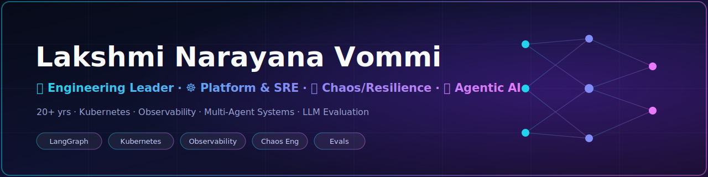

# Hi, I'm Lakshmi Narayana Vommi 👋

<strong><code>🧭 Engineering Leader · ☸️ Platform & SRE · 🔥 Chaos / Resilience · 🤖 Agentic AI</code></strong>

*Designing AI solutions with RAG and observability expertise.*

  

## ⌨️ What I Do

Engineering leader with **20+ years** across **Platform Engineering, SRE, Performance & Chaos
Engineering, and cloud-native reliability** in global SaaS. Lately I'm building **agentic AI
systems** for operations — and making them measurable.

- Lead **platform & resilience** programs: multi-region SaaS, observability, developer self-service
- **Harden systems**: failure-mode analysis, fallbacks/retries, chaos & performance testing
- Build **multi-agent systems** (LangGraph, RAG/GraphRAG) and **evaluate** them (golden datasets, LLM-as-judge, LangSmith)
- Run agents against **real infrastructure** — Kubernetes, Prometheus/Grafana/Loki/Tempo, alerting, on-call

---
### 🧰 Tech Stack

---

## 💼 Experience

- **Senior Resilience Engineer** — *Goodnotes* (2026) · resilience assessments of critical
  services; fixed tight SQS/Redis coupling, missing timeouts, unbounded retries; engineered
  fallbacks, session caching (Kratos), and observability-driven debugging.
- **Platform Engineering Manager** — *Sysdig* (2023–2026) · SaaS region build-outs and
  high-throughput/low-latency ingestion tuning; rolled out **Backstage** Developer Portals
  (–25% onboarding); improved **MTTR by 30%**; workflow automation with **n8n**; led
  **Agentic AI** exploration for real-time monitoring, anomaly detection & platform decisions.
- **Head of Chaos Engineering** — *Behavox* (2021–2023) · chaos frameworks across distributed
  data pipelines: **+40% throughput**, **–30% latency**, **–25% high-sev incidents**, **MTTR –35%**.
- **Manager, Systems Testing & Performance** — *MobileIron* (2018–2021).
- Earlier: *Novell*, *VMware*, *Wipro–Citrix* — QA, performance & systems engineering.

## 📜 Certifications

- **CKA** — Certified Kubernetes Administrator (Linux Foundation)
- **AWS Certified Solutions Architect – Associate**
- **Chaos Engineering Practitioner** (Harness)
- **n8n Academy** — Essentials: Your First Workflows · n8n Quickstart

---

## 🚀 Featured Project

**StreamFlix Incident-Response Platform** — an imaginary streaming company made *real* on
Kubernetes: 35 microservices generated from a knowledge graph, full observability stack,
alerting + runbooks, a **Backstage** software catalog, and a **multi-agent incident-response
agent** that runs against **live** cluster signals (triage → diagnose → mitigate → resolve →
postmortem) — with a complete **evaluation framework** (40-case golden dataset, code-based +
LLM-as-judge evaluators, LangSmith traces). A direct extension of the platform, chaos, and
agentic-AI work above.

---

## 📝 Philosophy

- Systems over demos
- One source of truth over copy-paste
- Measure it, or you don't trust it
- If I can't break it on purpose, I don't understand it

---

## 🤝 Connect

  
  
  

